# Brain Tumor Detection (CNN)

*Deep-learning classification of brain MRI scans as tumor / non-tumor — three custom CNNs vs. VGG16 transfer learning, with EDA, training curves, confusion matrices, and ROC analysis.*

    

**Tech stack & skills:** Python · TensorFlow / Keras · scikit-learn · NumPy · Pillow · Matplotlib · seaborn — covering image loading & preprocessing, grayscale conversion and scaling, train/validation/test splitting, CNN design, data augmentation, early stopping, transfer learning (VGG16), and model evaluation with accuracy, precision, recall, F1, confusion matrices, and ROC/AUC.

This project detects brain tumors from MRI scans using deep learning. A custom Convolutional Neural Network (CNN) is developed in several variants and compared against a pre-trained VGG16 model, to classify scans as **tumor** (`yes`) or **non-tumor** (`no`) and support early diagnosis.

> **Disclaimer:** This is an educational machine-learning project, not a medical device. It must not be used for real clinical diagnosis.

## Project Structure

```
Brain-Tumor-Detection-CNN/
├── README.md
├── LICENSE
├── requirements.txt
├── brain_tumor_detection.ipynb         # main notebook
├── Data/
│   └── brain_tumor_dataset/
│       ├── yes/                         # 155 tumor MRI images
│       └── no/                          #  97 non-tumor MRI images
├── Figures/                            # plots (embedded below)
├── Tables/                             # dataset & metrics tables (CSV + Markdown)
├── Results/                            # model_metrics.csv / .json
└── Scripts/
    └── generate_analysis.py            # reproducible EDA + metrics pipeline
```

## Dataset

A binary MRI image dataset of **252 scans** — 155 tumor (`yes`) and 97 non-tumor (`no`). Images are loaded from `Data/brain_tumor_dataset/`, converted to grayscale, resized, and scaled before modelling.

**Dataset composition**

| Class | images | pct |
|:------|-------:|----:|
| Tumor (yes) | 155 | 61.5 |
| Non-tumor (no) | 97 | 38.5 |
| Total | 252 | 100.0 |

**Image size statistics**

| metric | min | median | max | mean |
|:-------|----:|-------:|----:|-----:|
| Width (px) | 150 | 278 | 1920 | 355 |
| Height (px) | 168 | 331 | 1427 | 387 |
| File size (KB) | 3.4 | 20.2 | 710.8 | 33.6 |

## Exploratory Data Analysis

Generated directly from the images by `Scripts/generate_analysis.py`. The dataset is moderately imbalanced (more tumor than non-tumor scans) and image sizes vary widely, so resizing to a fixed input is essential. The per-class **average image** is revealing: tumor scans are brighter and fuller on average, while non-tumor scans show clearer central ventricle structure.

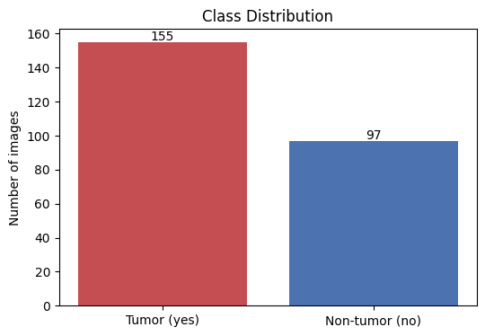
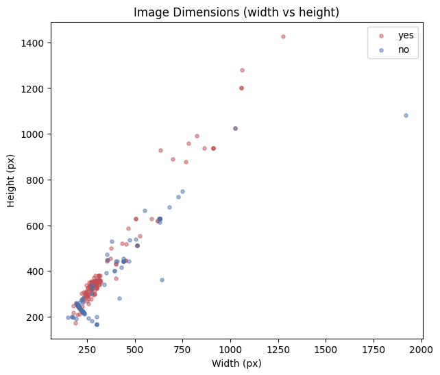
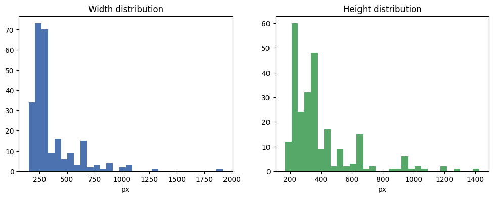
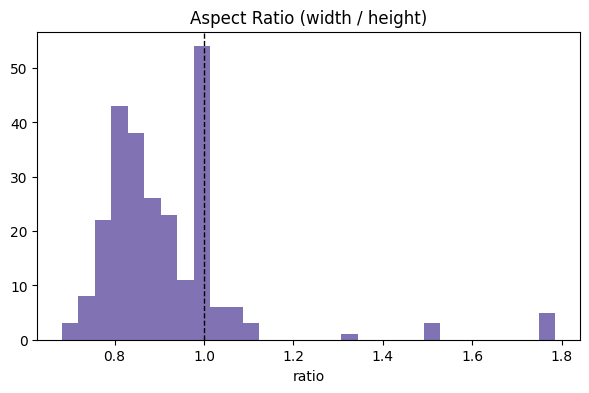
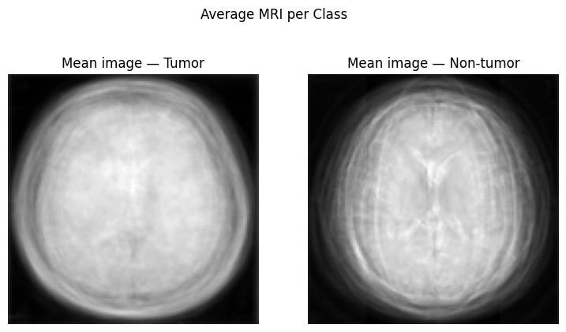
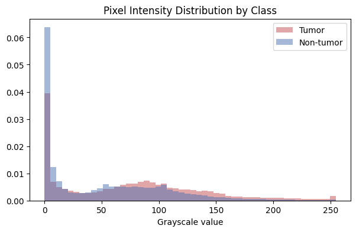

## Requirements

- Python 3.9+
- Packages in `requirements.txt`: `tensorflow`, `scikit-learn`, `numpy`, `pillow`, `matplotlib`, `seaborn`, `notebook`

## Setup and Run

### Option 1 — Locally with Jupyter

```bash
python -m venv .venv
source .venv/bin/activate        # on Windows: .venv\Scripts\activate
pip install -r requirements.txt
jupyter notebook
```

Then open `brain_tumor_detection.ipynb` and run the cells top to bottom. The notebook reads images from `Data/brain_tumor_dataset/`.

### Option 2 — Google Colab

1. Upload `brain_tumor_detection.ipynb` to [Google Colab](https://colab.research.google.com/).
2. Upload the `brain_tumor_dataset` folder (or mount Google Drive) so it is reachable at `Data/brain_tumor_dataset`.
3. Run each cell in order.

## Workflow

1. **Data loading** — read MRI images from the `yes` / `no` folders.
2. **Data analysis** — visualise sample tumor and non-tumor scans.
3. **Preprocessing** — grayscale conversion, resizing, and pixel scaling.
4. **Splitting** — train / validation / test partitions.
5. **Modelling** — three custom CNN variants and one VGG16 transfer-learning model.
6. **Evaluation** — accuracy, precision, recall, F1, confusion matrix, and ROC/AUC for each model.

## Sample Data

Representative tumor and non-tumor MRI scans from the dataset:

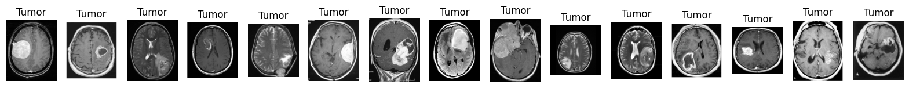
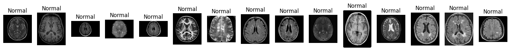
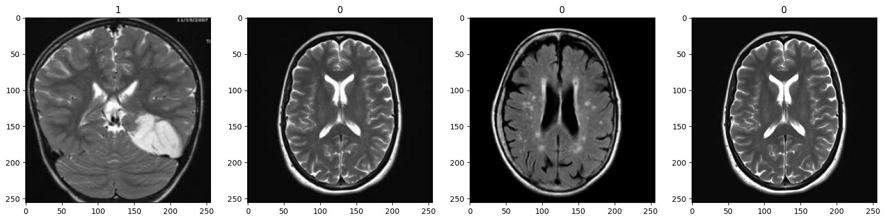

## Models & Results

Four models were trained and evaluated on the held-out test set. Results (from the confusion matrices and ROC curves below):

| Model | Accuracy | Precision | Recall | F1 | ROC AUC |
|:------|:--------:|:---------:|:------:|:--:|:-------:|
| CNN — 3 conv blocks + early stopping | 0.967 | 0.946 | 1.000 | 0.972 | 0.98 |
| CNN — 2 conv blocks | 1.000 | 1.000 | 1.000 | 1.000 | 1.00 |
| CNN — 3 conv blocks + data augmentation | 1.000 | 1.000 | 1.000 | 1.000 | 1.00 |
| VGG16 (transfer learning) | 0.540 | 0.605 | 0.742 | 0.667 | 0.54 |

*(Metrics computed with tumor as the positive class; also saved in `Results/model_metrics.csv` and `Tables/04_per_model_metrics.md`.)*

The custom CNNs clearly outperformed the pre-trained VGG16 here — VGG16, designed for RGB natural images, transfers poorly to small grayscale MRI scans without deeper fine-tuning. Note that the test set is small (~60 images), so the ~100% scores should be read as "very strong on this split" rather than a guarantee of clinical-grade generalisation; a larger dataset and cross-validation would be needed to confirm.

### 1. CNN — 3 conv blocks + early stopping

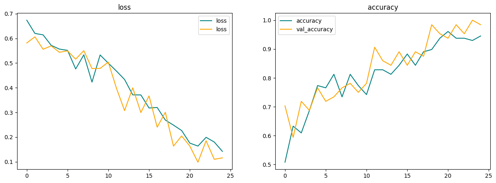
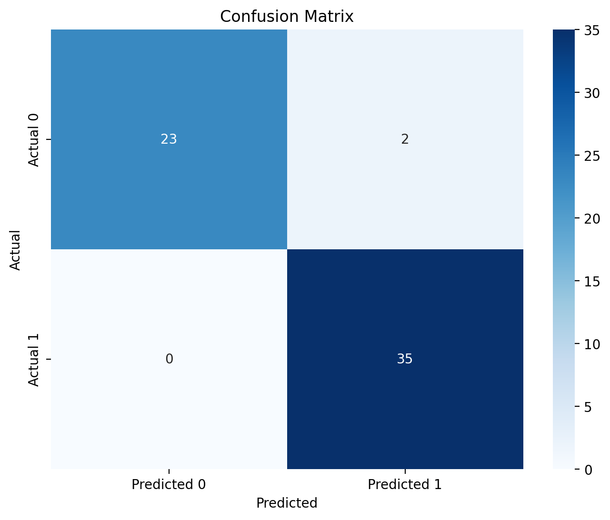
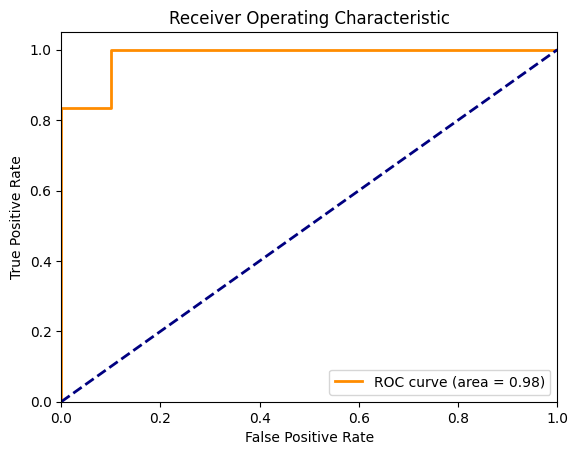

### 2. CNN — 2 conv blocks

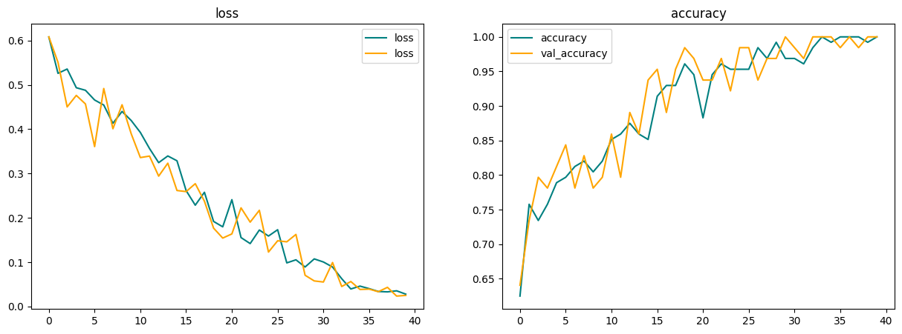
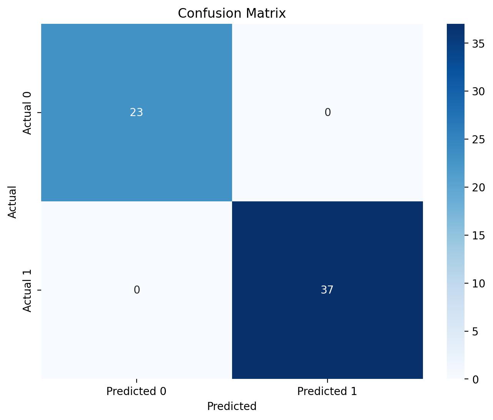
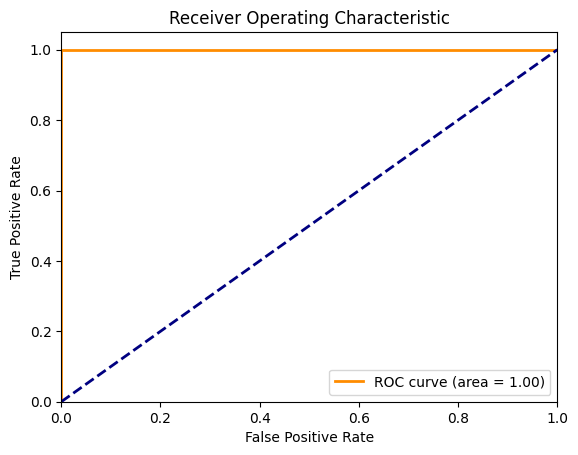

### 3. CNN — 3 conv blocks + data augmentation

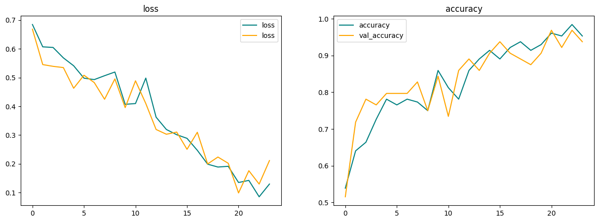


### 4. VGG16 (transfer learning)

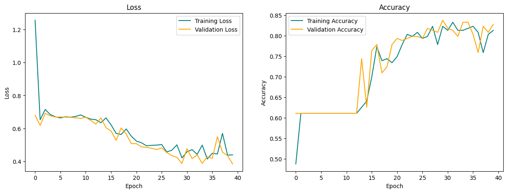
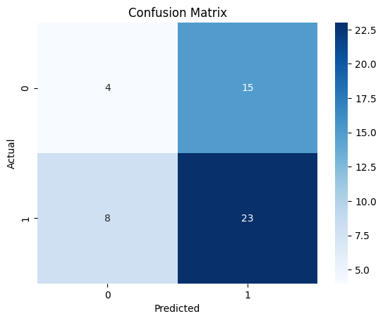
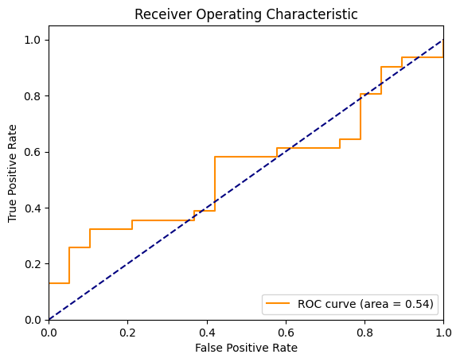

## Key Findings

- Custom CNNs trained from scratch reached 97–100% accuracy on the test split, with ROC AUC ≥ 0.98.
- Data augmentation and early stopping both produced strong, stable convergence.
- VGG16 transfer learning underperformed (AUC ≈ 0.54) — pre-trained RGB features don't transfer well to small grayscale medical images without deeper fine-tuning.
- The dataset is small (252 images); results are promising but would need a larger, well-separated dataset and cross-validation before any real-world claims.

## About

This project began as a university deep-learning assignment and was reworked into a standalone portfolio project. The MRI dataset is a publicly available brain-tumor image set.

## License

Released under the [MIT License](LICENSE).
